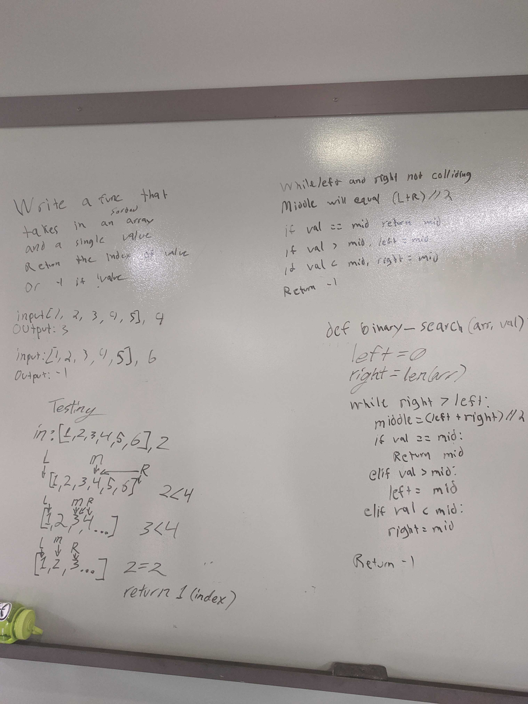

### [Home](../README.md)

# Array Shift
With a list and value as the input make a function that will insert the value into the center of that list.

## Challenge
Create a function that takes in both a sorted list and a value. The function should then use binary search to look through the list and if it contains the value then returns the index. Otherwise return -1

## Approach & Efficiency
O(n) for Iterative Approach

## Solution

[Code](./array_binary_search.py)  
[Tests](./test_array_binary_search.py)  