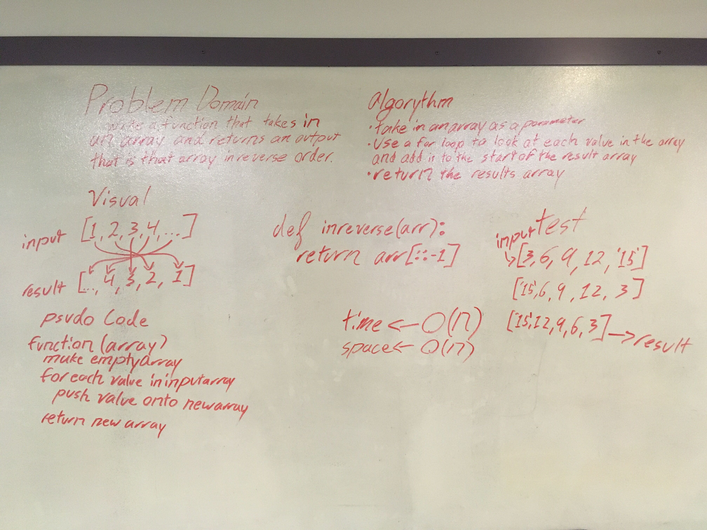

### [Home](../README.md)

# Reverse an Array

## Challenge
Create a function that will take in an array and return an array with the values reversed

## Approach & Efficiency
Used `arr[::-1]`  
Time -> O(n)?  
Space -> O(n)?  
I still don't know how to get the exact valuse I assume we will cover that

## Solution

[Code](../challenges/array-reverse.py)  