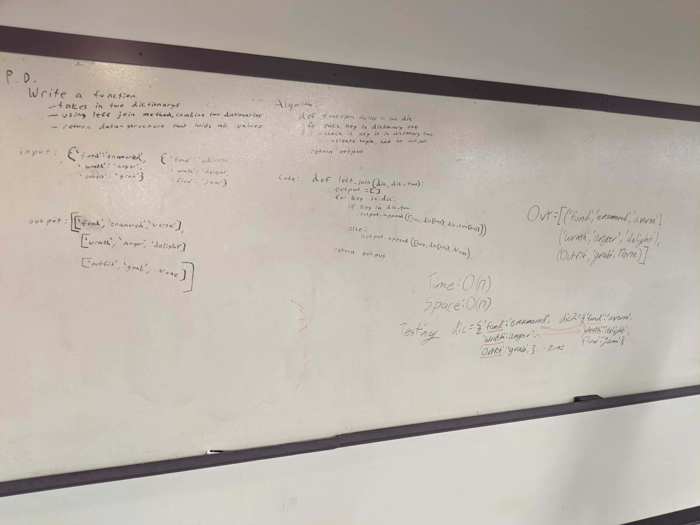

[Home](../../README.md)
# Left Join Hash Table
[Code](./left_join.py) 
[Tests](./test_left_join.py) 
[Helper Methods](./helper_hash_table.py) 
## Challenge
The challenge is to create a function that takes in 2 hash tables (python dictionaries). It then returns a structure of values that left joins the two tables.
## Approach
My approach is to iterate over each key in the left table. With each key append to the output with it's value and if there is a corresponding key in right add it too else None.
## API
join()
- In: 2 Hash Tables
- Out: List of tuples containing (key, table_one_value, table_two_value)

## Efficiency
join()
- Time:
- Space:
### Whiteboard

