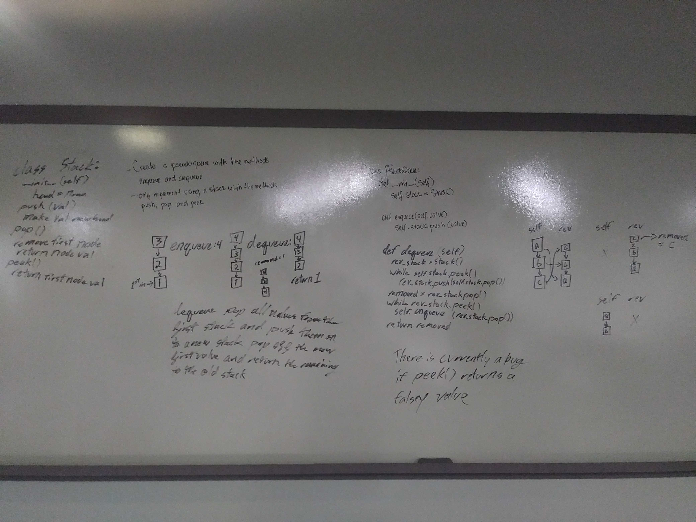

### [Home](../README.md)

# Queue from Stacks
The goal is to write a Queue class that has the functions of both `enqueue` and `dequeue` while only relying on stacks. The stack class has the methods `push` `pop` and `peek` to help you.

## Challenge
Write a function for both adding and removing a value from a queue. The Queue should be built using upto 2 stacks but still function like how a queue would.

## Approach & Efficiency
Enqueue: Time: `O(1)`   Space: `O(1)` 
Dequeue: Time: `O(n)`   Space: `O(n)` 

## Solution
##### [Code](./queue_with_stacks.py)
##### [Tests](./test_queue_with_stacks.py)

