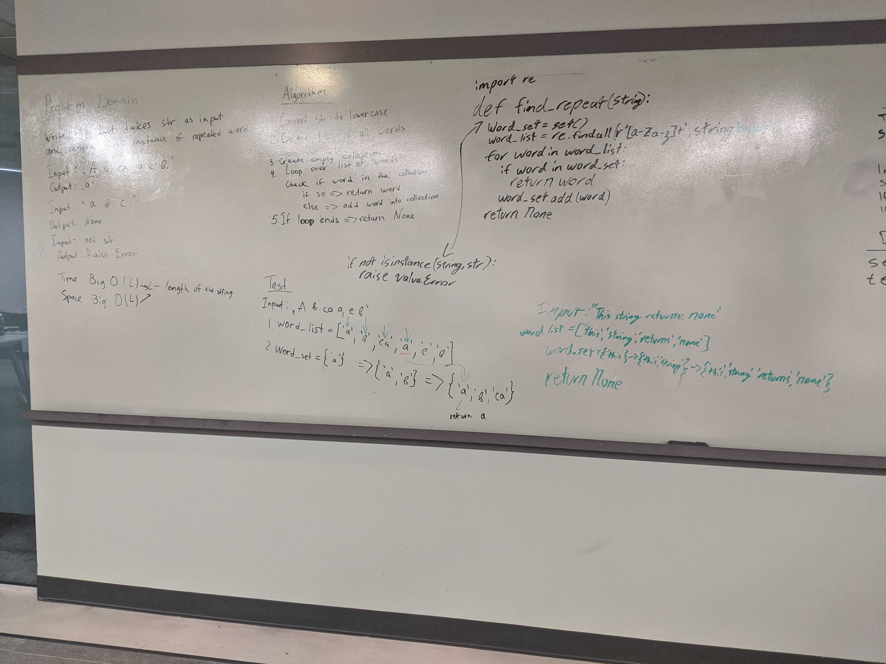

[Home](../../README.md)
# Find Repeat

[Code](./repeated_word.py) 
[Tests](./test_repeated_word.py)

## Challenge
The Goal is to create a function that can take in a string as an input and return the first repeated word within that string. If there are no repeated words then just return None.

###### Edge Case: `can't` or any word with an apostrophe

## Approach
I used regex to split the string around the letters (apostrophes where included) and put it all in a list. I then looped the list adding the words to a set. If the set contained the word the function then returned the word instead. Last if the word list is exhausted then return `None`.

## Efficiency
#### Find Repeat Words:
  - Time: `O(N)` 
  - Space: `O(N)` 
N is the number of words in the string.
## API
#### Find Repeat Words:
- In: `String`
- Out: `String/None`
- Exception: Input other then String

