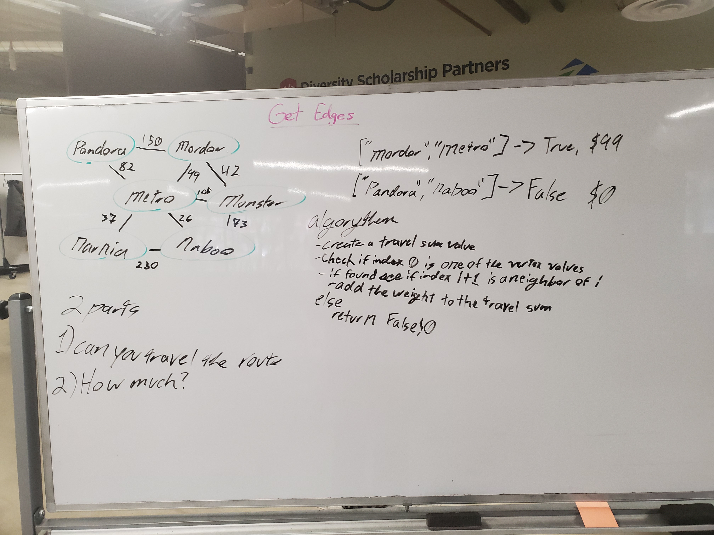
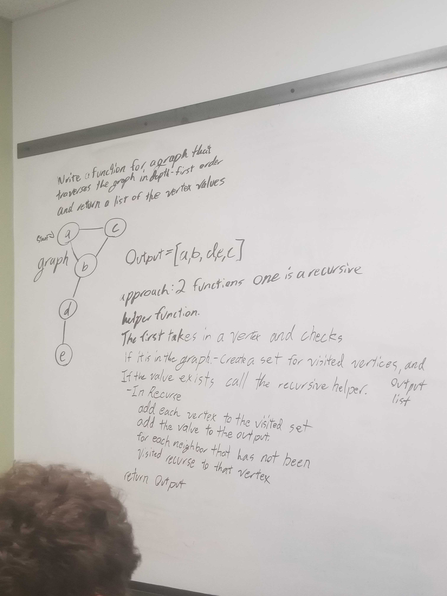
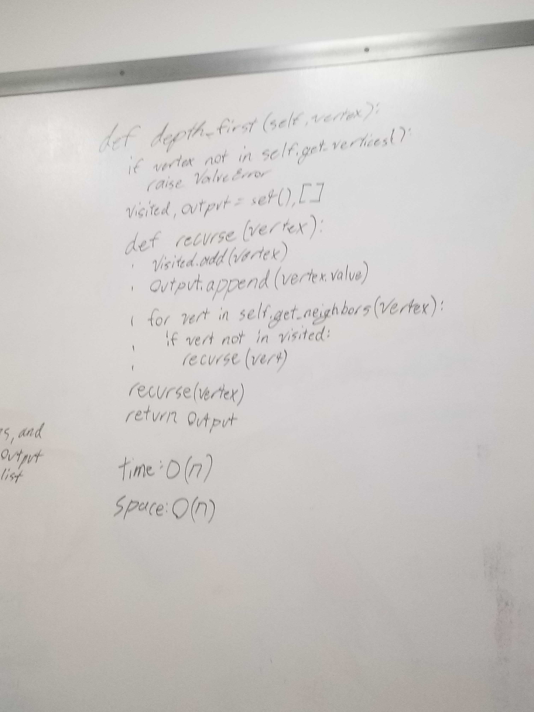

[Home](../../README.md)
# Graphs

[Code](./graphs.py) 
[Tests](./test_graphs.py)

## Challenge/Data Structure
Today's data structure is to create a graph. The corresponding methods in the graph that we need to flesh out are `add`, `add_edge`, `get_neighbors`, `get_vertices` and `size`
## Approach
`add`
  - Takes in a value and creates a vertex. The new vertex is added to the the graph. Finally return the new vertex. 

`add_edge`
  - Takes in 2 vertices that are in the graph. There is an optional parameter for weight.  

`get_neighbors`
  - Takes in a vertex and returns all other vertices that it has connections to. 

`get_vertices`
  - Returns a list of all vertices that are in the graph. 

`size`
  - There us an internal dictionary that is used by the graph. returning the size will tell you the number of 
## API
`add`
  - In: Value
  - Out: Vertex with the value

`add_edge`
  - In: 2 vertices, optional: Weight `<int>`
  - Out: None

`get_neighbors`
  - In: Vertex
  - Out: List of tuples containing edges `(<vertex>, Weight)`

`get_vertices`
  - In: `None`
  - Out: List of all `<vertices>`

`size`
  - In: None
  - Out: Number of vertices (`<int>`)

#  
## Breath First Traversal
### Challenge
Create a function that preforms a breath first traversal to create a list of all values in the graph
### Approach
My approach is to create 2 functions. The first is to do a traversal from a given vertex. This is a private function that is used to help in other functions. Next is the callable function. This is where the action function is defined. That function is used in the traverse function to create the output list.
### API
`breath_first`
- `(<Vertex>)`
- Call `__traverse`
- Return: `List`

`__traverse`
- `(<Vertex>, action)`
`action` is a function reference to an action to preform on each vertex

### Efficacy
`breath_first()`
- Time: `O(n)`
- Space: `O(n)`

## Get Edges
[Tests](./test_get_edges.py)
### Challenge
Create a function that takes in a list of vertex values as strings and returns `True/False` if the vertices can be traversed in order. Next if the if `True` is returned also return the sum of the edge weights. If `False` is returned just return 0.
### Approach
Like many of my challenges I used a helper function. This function takes in a list and a string an will return if a vertex with that value are in the list. This works for both the keys list that is only contains vertices as well as the neighbor list of tuples. The rest of the logic is far more straight forward where the it keeps checking the neighbors of each node to see if the connection can be made and if not returning `False`. If the end of the list is reached the `True` and the sum of weights is returned instead.
### API
`get_edge`
- In: `(<List> of Vertex Values)`
- Out: `(True/False, '$<Int>')`
### Efficiency
`get_edge`
- Time: `O(n``2``)`
- Space: `O(1)`
#### Images

#  
## Depth First Traversal
[Tests](./test_depth_first.py)
### Challenge
Create a method to traverses a tree in depth first order and returns a list of the values at each vertex that's visited.
### Approach
**Surprise!!** I created a helper function. This is the `__recurse` function that takes a vertex and an action. This function starts at the given vertex and travels the graph looking at each position. At each vertex preform the action. Then recuse to each non visited vertex.
### API
`depth_first`
- In: `<Vertex>`
- Out: `<List>`
### Efficiency
`depth_first`
- Time: `O(n)`
- Space: `O(n)`

