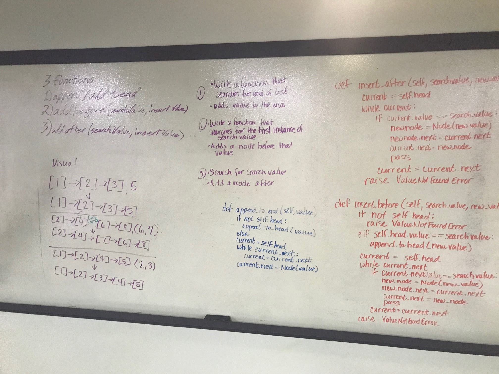

# Singly Linked List
The goal fo this code challenge is to make a simple linked list

### Links
[Tests](./test_linked_list.py) 
[Linked List Class](./linked_list.py) 
[Node Class](./node.py) 

## Challenge
Create 2 classes one for Nodes and one for Linked Lists. Create 3 functions to the linked list that 1:Adds a value to the front of the linked list, 2:Search throught the list to see if it contains the given value returning true or false, 3:Create a `__str__` function to print the list

## Approach & Efficiency
Insert: `O1`   
Includes: `O(n)` 
To String: `O(n)` 

## APIs
Insert In: `value` -> Out: `None`   
Includes In: `value` -> Out: `True/False`   
To String In: `None` -> Out: `String`   
#  
# Linked List Insertions
## Challenge
Create 3 methods for the linked list class all based around inserting the value in different locations. One for the end of the list. One for the before a given value and one for after a given value. Both the before and after should thow an error if the value you are looking for can not be found.

## Approach & Efficiency
Append: `O(n)`   
Insert Before: `O(n)`   
Insert After: `O(n)`   

## APIs
Append: In: `Value` -> Out: `None`   
Insert Before: In: `Search Term, Input Value` -> Out: `True/Error`   
Insert After: In: `Search Term, Input Value` -> Out: `True/Error`   

