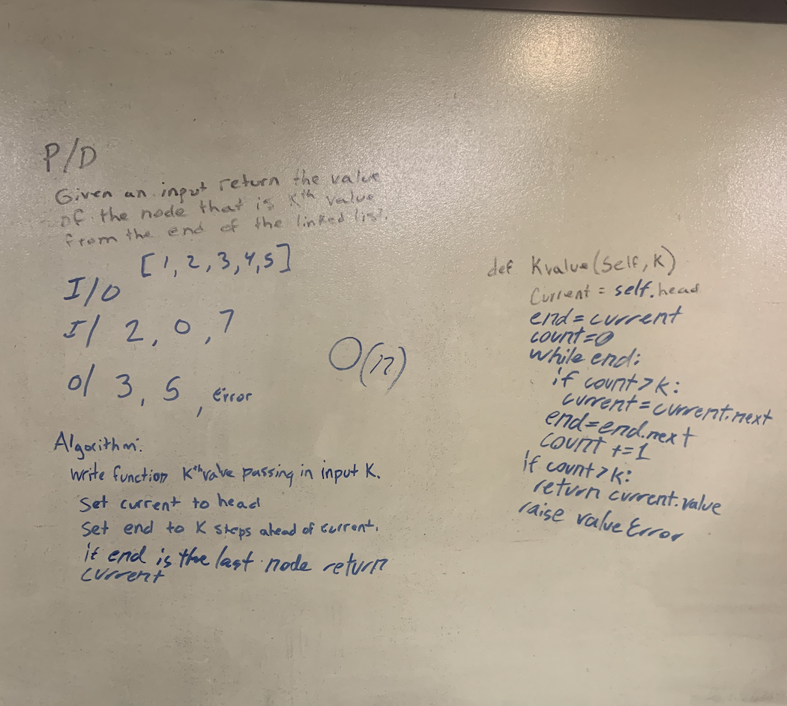

# Singly Linked List
The goal fo this code challenge is to make a simple linked list

### Links
[Tests](./test_linked_list.py) 
[Linked List Class](./linked_list.py) 
[Node Class](./node.py) 

## Challenge
Create 2 classes one for Nodes and one for Linked Lists. Create 3 functions to the linked list that 1:Adds a value to the front of the linked list, 2:Search throught the list to see if it contains the given value returning true or false, 3:Create a `__str__` function to print the list

## Approach & Efficiency
Insert: `O1`   
Includes: `O(n)` 
To String: `O(n)` 

## APIs
Insert In: `value` -> Out: `None`   
Includes In: `value` -> Out: `True/False`   
To String In: `None` -> Out: `String`   
#  
# Linked List Insertions
## Challenge
Create 3 methods for the linked list class all based around inserting the value in different locations. One for the end of the list. One for the before a given value and one for after a given value. Both the before and after should thow an error if the value you are looking for can not be found.

## Approach & Efficiency
Append: `O(n)`   
Insert Before: `O(n)`   
Insert After: `O(n)`   

## APIs
Append: In: `Value` -> Out: `None`   
Insert Before: In: `Search Term, Input Value` -> Out: `True/Error`   
Insert After: In: `Search Term, Input Value` -> Out: `True/Error`   

#  
# Kth Value From the End
## Challenge
Create a method that takes in an index and returns the value of the node at that position. If the position is outside of the bounds of the list the function should raise an error.

## Approach & Efficiency
#### kth_from_end:
* Time: `O(n)` 
* Space: `O` 

## APIs
kth_from_end: In: `Position` -> Out: `Value/Error` 

#  
# Merge Linked Lists
**I know that the instruction say to use a new file. I cleared this with JB so I could practice static methods**
## Challenge
Create a method that takes in 2 linked lists as the inputs and returns the head of the merged list as an output. The lists should be mreged in a zipper fasion (one then the other).

## Approach & Efficiency
#### mrege_linked_lists:
* Time: `O(n)` 
* Space: `O(1)` 

## APIs
merge_linked_lists: In: `ll_one, ll_two` -> Out: `merged_list_head` 

